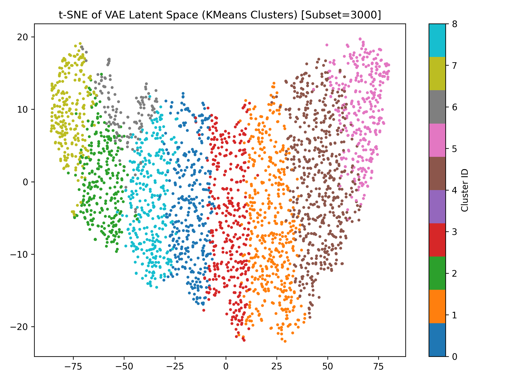

# VAE Music Clustering Project

This project implements an unsupervised learning pipeline for clustering hybrid language music tracks using Variational Autoencoders (VAE).

## Project Structure

- `data/`: Stores the datasets (audio and lyrics).
- `notebooks/`: Contains Jupyter notebooks for exploratory data analysis and visualizations.
- `src/`: Contains Python scripts for VAE implementation, data processing, clustering, and evaluation.
- `results/`: Stores output results such as latent space visualizations and clustering metrics.

## Requirements

To install the required libraries, run:
```bash
pip install -r requirements.txt
 


## Dataset

This project uses the Hugging Face dataset: **ccmusic-database/music_genre**  
Dataset page: https://huggingface.co/datasets/ccmusic-database/music_genre

The dataset is not included in this GitHub repository because it is large.
It will be downloaded automatically when running the scripts below.


## Results

We evaluated the clustering quality using multiple metrics.

### VAE + KMeans
- Silhouette Score: 0.1827
- Calinski-Harabasz Index: 32353.64
- Adjusted Rand Index (ARI): 0.0980
- Normalized Mutual Information (NMI): 0.2013

### PCA + KMeans (Baseline)
- Silhouette Score: 0.1508
- Calinski-Harabasz Index: 8947.86

The VAE-based latent representation shows improved clustering performance
compared to the PCA baseline, indicating that the VAE learns a more
discriminative latent space for music features.


### Latent Space Visualization

The following figure shows the t-SNE visualization of the VAE latent space
colored by KMeans cluster assignments.




## Conclusion

This project demonstrates that Variational Autoencoders can effectively learn
meaningful latent representations for unsupervised music clustering, achieving
better performance than traditional PCA-based methods.
