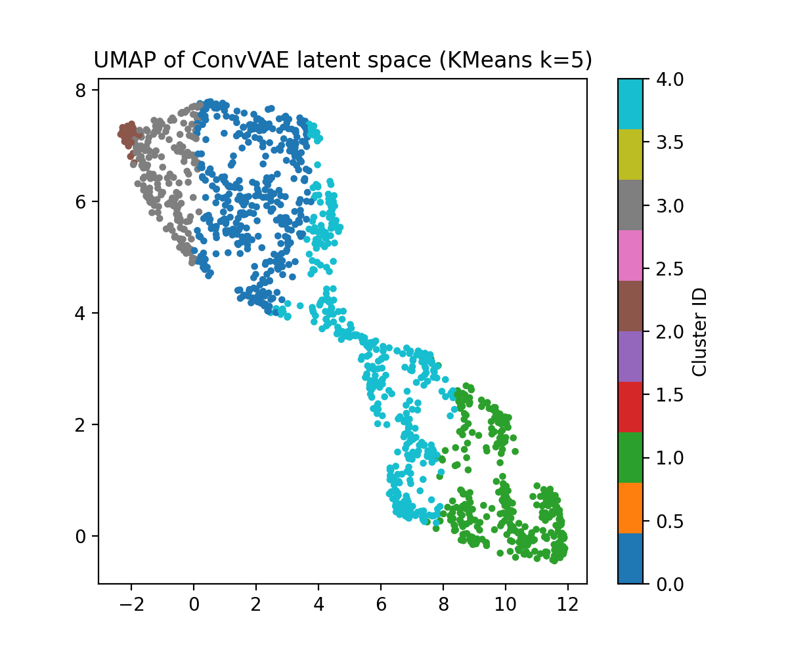

# VAE Music Clustering Project

This project implements an unsupervised learning pipeline for clustering hybrid language music tracks using Variational Autoencoders (VAE).

## Project Structure

- `data/`: Stores the datasets (audio and lyrics).
- `notebooks/`: Contains Jupyter notebooks for exploratory data analysis and visualizations.
- `src/`: Contains Python scripts for VAE implementation, data processing, clustering, and evaluation.
- `results/`: Stores output results such as latent space visualizations and clustering metrics.

## Requirements

To install the required libraries, run:
pip install -r requirements.txt
 

# VAE Music Clustering Project

This project implements an unsupervised learning pipeline for clustering music tracks using Variational Autoencoders (VAE).  
The work is divided into two parts: **Easy Task** and **Medium Task**, following the course project requirements.

---

## Project Overview

- **Easy Task**: Basic VAE-based clustering of music features.
- **Medium Task**: Advanced multi-modal and convolutional VAE architectures with hybrid audio–lyrics representations and comparative clustering analysis.

---

## Easy Task (Summary)

In the easy task, a basic VAE was trained on music features and clustered using K-Means.  
The results demonstrate that VAE-based latent representations outperform PCA-based baselines for unsupervised music clustering.

*(Details and notebooks for the easy task are provided in the repository.)*

---

## ⭐ Medium Task (Main Contribution)

The medium task significantly extends the easy task by incorporating **hybrid features**, **convolutional architectures**, and **comprehensive clustering evaluation**, as required by the project rubric.

### Dataset Used

- **1432 paired audio–lyrics music tracks**
- Each sample contains:
  - Audio preview (MP3)
  - Corresponding song lyrics

The dataset is not included in this repository due to size constraints.

---

### Feature Extraction

**Audio Features**
- MFCC (Mel-Frequency Cepstral Coefficients)
- Number of coefficients: 40  
- Maximum frames: 300  
- Final audio feature dimension: **12000**

**Lyrics Features**
- TF-IDF vectorization
- Maximum vocabulary size: **5000**

---

### Models Implemented

#### 1. Fusion Dense VAE (Audio + Lyrics)
- Input: Concatenated MFCC + TF-IDF features
- Encoder–decoder architecture using fully connected layers
- Learns a joint latent representation of musical and lyrical content

#### 2. Conv1D VAE (Audio-only)
- Input: MFCC sequences
- Encoder: 1D convolutional layers to capture temporal structure
- Decoder: Transposed convolution layers
- Latent dimension: 16
- Designed to model local timbral and rhythmic patterns in music

---

### Clustering Methods

Latent representations were clustered using:
- **KMeans**
- **Agglomerative Clustering**
- **DBSCAN**

---

### Evaluation Metrics

Clustering quality was evaluated using:
- **Silhouette Score**
- **Davies–Bouldin Index**

These metrics are suitable for unsupervised clustering without ground-truth labels.

---

## How to Reproduce the Medium Task

Run the notebooks in the following order:

1. `medium_01_data_prep.ipynb`  
2. `medium_02_lyrics_embeddings.ipynb`  
3. `medium_03_audio_mfcc.ipynb`  
4. `medium_04_vae_clustering_clean.ipynb`

**Note:**  
The dataset files (audio, lyrics, and intermediate features) are not included.  
Users must place the required files in the `data/` directory as described in the notebooks.

---

## Results (Medium Task)

### Quantitative Results

| Method                     | Clusters (k) | Silhouette | Davies–Bouldin |
|---------------------------|--------------|------------|----------------|
| **ConvVAE (audio) + KMeans** | 5            | **0.3498** | **0.9217** |
| Fusion Dense VAE + KMeans | 5            | 0.1848     | 1.4311 |
| PCA + KMeans (Baseline)   | 5            | 0.0471     | 3.4246 |
| DBSCAN                    | —            | -0.3183    | 2.1785 |

The ConvVAE-based approach achieves the best clustering performance, indicating the importance of convolutional architectures for modeling audio structure.

---

### Latent Space Visualization

**UMAP projection of ConvVAE latent space (KMeans, k=5):**

---

## Conclusion

This project demonstrates that convolutional variational autoencoders significantly improve unsupervised music clustering performance compared to dense VAE and PCA baselines.  
The results highlight the effectiveness of modeling temporal audio structure using Conv1D architectures and provide a strong foundation for future work on multi-modal music representation learning.
